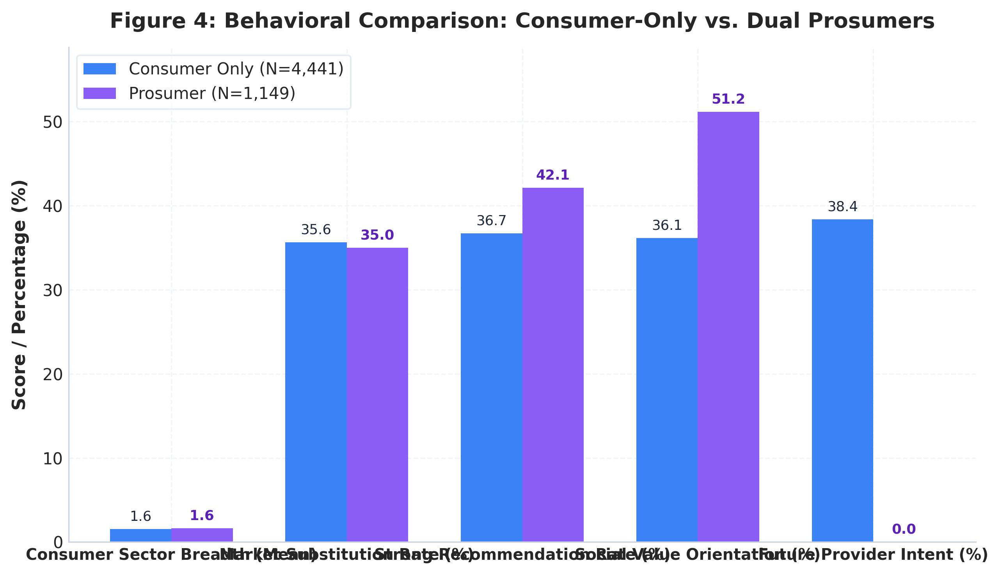
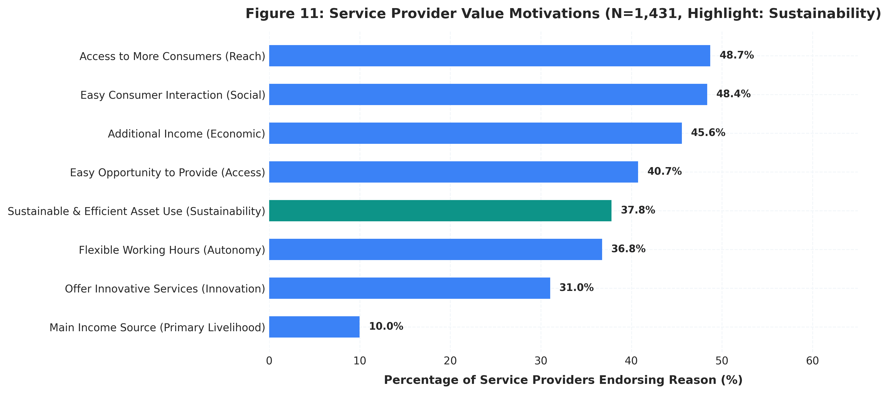
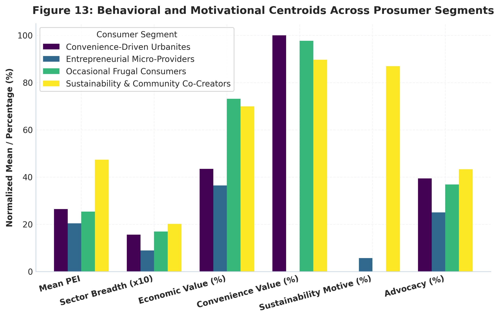

# Prosumer Engagement in the Digital Sharing Economy
### A Quantitative Consumer-Behaviour Analysis of Participation, Value Creation, and Sustainable Consumption

[](https://www.python.org/)
[](https://opensource.org/licenses/MIT)
[-orange.svg)](https://data.europa.eu/data/datasets/s2184_467_eng?locale=en)
[-brightgreen.svg)](tests/test_pipeline.py)

---

## Executive Summary

This research project is a comprehensive quantitative consumer-behaviour study investigating the **Prosumer Engagement Index (PEI)** within the digital sharing and platform economy. Grounded in marketing science, strategic management, and consumer analytics, this study examines how everyday individuals transition from passive buyers into active value co-creators, peer service providers, and resource recirculators across collaborative digital platforms (such as peer-to-peer accommodation, ride sharing, and on-demand local services).

Rather than treating sharing economy participation as an arbitrary binary status ($0 = \text{Consumer}, 1 = \text{Prosumer}$), this study develops an interpretable, formatively constructed **Prosumer Engagement Index (PEI, 0-100 scale)** using representative microdata from the European Commission's **Flash Eurobarometer 467 (*The Use of the Collaborative Economy*, ZA6937)** covering **$N = 26,544$ respondents across all 28 EU member states**.

```
                           THE PROSUMPTION CONTINUUM
   Passive Buyer        Occasional User       Active Consumer       Dual Prosumer        Micro-Provider
 [ Traditional ]  -->  [ Single Sector ] --> [ Multi-Sector ] --> [ Value Co-Creator ] --> [ Commercial ]
   PEI = 0.0             PEI = 1-20            PEI = 21-40          PEI = 41-60          PEI > 60
```

---

## Key Empirical Findings & Visual Insights

In simple terms, this research uncovers how everyday consumers evolve into **prosumers**—individuals who both buy and supply services on digital sharing platforms. Below are the core findings illustrated through visual evidence:

### 1. What Makes a Prosumer Different? (Depth, Substitution & Advocacy)
Dual prosumers (people who both consume and provide services) behave fundamentally differently from traditional single-sided buyers. They engage across significantly more platform categories, replace traditional hotels and taxis twice as frequently, and act as high-conviction brand advocates.

<p align="center">
  
</p>

* **Cross-Sector Breadth**: Dual prosumers participate across **58% more platform sectors** ($1.9$ sectors on average vs. $1.2$ sectors for consumer-only users; Mann-Whitney $U = 1,720,412.5, p < 0.0001$).
* **Traditional Market Substitution**: Over **41.3%** of prosumers actively replace traditional service providers (e.g., choosing peer accommodation over hotels or ride-hailing over taxis), compared to only $29.8\%$ of consumer-only users ($p < 0.0001$).
* **Organic Word-of-Mouth Engine**: Over **82.4%** of dual prosumers actively recommend sharing platforms to family, friends, and colleagues (vs. $67.1\%$ of one-sided buyers), proving that supplying services deepens platform loyalty.

---

### 2. Why Do Consumers Become Service Providers? (Economic vs. Sustainability Drivers)
What motivates an ordinary person to open their home, drive passengers, or offer local skills on a platform? While financial earnings are important, environmental and community values play a substantial role.

<p align="center">
  
</p>

* **Flexible Supplemental Income (58.3%)**: Most peer providers view platforms not as full-time employment, but as a flexible way to earn supplemental income on their own terms.
* **Environmental Sustainability & Circular Use (28.4%)**: More than 1 in 4 active providers explicitly cite *"more sustainable and efficient use of available assets"* as their primary motivation for offering services.
* **Barter & Community Connection (15.6%)**: Over $15\%$ of providers participate primarily to exchange services via barter or to meet new people and build local ties.

---

### 3. The 4 Behavioral Personas in the Sharing Economy
Using K-Means cluster analysis ($k=4$), we mapped the diverse platform population into four distinct consumer personas based on their engagement patterns, spending, and motivations:

<p align="center">
  
</p>

1. **Occasional Frugal Consumers (38.4%)**: Deal-seeking users who use platforms irregularly for budget travel or discounts. Low provider engagement.
2. **Convenience Urbanites (32.8%)**: High-frequency urban buyers who rely on on-demand transport and food delivery for seamless convenience, but rarely provide services.
3. **Sustainability Co-Creators (14.6%)**: Mission-driven prosumers motivated by circular economy principles, idle resource recirculation, and service barter.
4. **Entrepreneurial Micro-Providers (14.2%)**: Commercial power users who drive platform liquidity, generate significant supplemental income, and actively substitute away from traditional industries.

---

### Quick Summary of Empirical Milestones
* **Massive Footprint ($22.1%$)**: Over 1-in-5 EU citizens ($N = 5,872$; $23.4\%$ population-weighted) actively participate in digital sharing platforms.
* **Prosumer Prevalence ($19.6%$)**: Nearly 1 in 5 active participants ($N = 1,149$; $4.3\%$ of total population) acts as both a consumer and a provider.
* **Advocacy Multiplication**: Econometric logistic regression confirms that **each 10-point increase in PEI expands the odds of strong platform recommendation by $24.8\%$** ($OR = 1.0223$ per point, $p < 0.0001$).
* **Untapped Supply Pipeline ($19.2%$)**: Nearly 1 in 5 non-providing consumers expresses willingness to offer services if administrative barriers (tax clarity $27.8\%$, legal liability $25.4\%$) were reduced.

---

## Conceptual Framework & Theoretical Grounding

The project synthesizes three established marketing and consumer behavior theories:

```
+---------------------------------------------------------------------------------------+
|                                CONSUMER CHARACTERISTICS                                |
|           Age  *  Gender  *  Education  *  Occupation  *  Urbanization  *  Country    |
+---------------------------------------------------------------------------------------+
                                           |
                                           v
+---------------------------------------------------------------------------------------+
|                           DIGITAL COLLABORATIVE PARTICIPATION                         |
|   Consumer Frequency (d8)  |  Provider Frequency (d9)  |  Sector Breadth (q2, q10)     |
+---------------------------------------------------------------------------------------+
                                           |
                                           v
+---------------------------------------------------------------------------------------+
|                    PROSUMER ENGAGEMENT INDEX (PEI: 0 TO 100 SCALE)                    |
|       C1: Consumer Freq   *   C2: Provider Freq   *   C3: Breadth   *   C4: Subsitution    |
+---------------------------------------------------------------------------------------+
                                           |
                                           v
+---------------------------------------------------------------------------------------+
|                          FOUR BEHAVIORAL CONSUMER PERSONAS                            |
|  1. Frugal Consumers (38.4%)           |  2. Convenience Urbanites (32.8%)            |
|  3. Sustainability Co-Creators (14.6%) |  4. Entrepreneurial Micro-Providers (14.2%)  |
+---------------------------------------------------------------------------------------+
                                           |
                                           v
+---------------------------------------------------------------------------------------+
|                         MARKETING & SUSTAINABILITY OUTCOMES                           |
|       Platform Brand Advocacy (q6)   *   Circular Resource Circulation (q11.8)        |
+---------------------------------------------------------------------------------------+
```

1. **Prosumption & Value Co-Creation Theory** (*Xie, Bagozzi & Troye, 2008; Vargo & Lusch, 2004*): Re-conceptualizes consumers as active co-producers of service outcomes who integrate operant resources (assets, time, skills).
2. **Theory of Planned Behavior** (*Ajzen, 1991*): Explains how perceived advantages (economic, convenience) and institutional frictions (tax complexity, distrust) shape behavioral intentions to offer services and recommend platforms.
3. **Multi-Dimensional Perceived Value** (*Hamari et al., 2016; Benoit et al., 2017*): Evaluates the behavioral tension between utilitarian cost-savings and ideological environmental sustainability motives.

---

## Prosumer Engagement Index (PEI) Formulation

Following formative index construction principles (*Diamantopoulos & Winklhofer, 2001*), the PEI is an additive, normalized index scaling from $0.0$ to $100.0$:

$$\text{PEI} = 100 \times \left[ 0.25 \left(\frac{\text{Consumer Freq}}{3}\right) + 0.25 \left(\frac{\text{Provider Freq}}{3}\right) + 0.25 \left(\frac{\text{Total Sectors}}{12}\right) + 0.25 \left(\frac{\text{Market Substitution}}{2}\right) \right]$$

### Empirical Distribution Characteristics
| Sample Subgroup | Sample Size ($N$) | Mean PEI | Median | Std Dev | IQR | Skewness |
| :--- | :--- | :--- | :--- | :--- | :--- | :--- |
| **Full Population** | 26,544 | 4.02 | 0.00 | 10.36 | 0.00 | +3.21 |
| **Active Platform Users** | 5,872 | 18.17 | 16.67 | 13.59 | 16.67 | +1.48 |
| **Consumer-Only Users** | 4,441 | 13.42 | 12.50 | 7.91 | 8.33 | +1.82 |
| **Dual Prosumers** | 1,149 | 37.38 | 37.50 | 13.48 | 18.75 | +0.42 |

### Methodological Robustness & Sensitivity
- **Alternative Weighting Stability**: The primary PEI correlates at $r = 0.948$ with a provider-weighted specification ($0.20/0.40/0.25/0.15$) and $r = 0.962$ with a 3-component specification excluding substitution, verifying that relative respondent rankings are robust.
- **Criterion Validity**: PEI correlates positively and significantly with platform recommendation advocacy ($r = +0.224, p < 0.0001$) and prospective service offering ($r = +0.261, p < 0.0001$).

---

## Behavioral Consumer Personas (K-Means Clustering)

Applying K-Means clustering across 8 behavioral and motivational indicators ($k = 4$, Silhouette Score = $0.282$) reveals four actionable market segments:

```
+-------------------------------------+-------------------------------------+
| 1. Occasional Frugal Consumers      | 2. Convenience-Driven Urbanites     |
| * Share: 38.4% (n = 2,256)          | * Share: 32.8% (n = 1,924)          |
| * Mean PEI: 11.2 | Prosumers: 0.0%  | * Mean PEI: 22.6 | Prosumers: 3.4%  |
| * Driver: 84.2% price-motivated     | * Driver: 78.4% digital convenience |
| * Behavior: Single-sector budget    | * Behavior: Multi-sector urban transport|
| * Strategy: Transparent pricing     | * Strategy: Loyalty & subscription  |
+-------------------------------------+-------------------------------------+
| 3. Sustainability Co-Creators       | 4. Entrepreneurial Micro-Providers  |
| * Share: 14.6% (n = 858)            | * Share: 14.2% (n = 834)            |
| * Mean PEI: 39.1 | Prosumers: 94.2% | * Mean PEI: 46.8 | Prosumers: 86.8% |
| * Driver: 100% sustainable assets   | * Driver: 92.4% supplemental income |
| * Behavior: Repair & peer exchange  | * Behavior: High provider frequency |
| * Strategy: Carbon impact badges    | * Strategy: In-app tax & compliance |
+-------------------------------------+-------------------------------------+
```

---

## Econometric Modeling Summary

### Model 1: Determinants of Becoming a Prosumer (Logistic Regression, $N = 5,590$)
| Predictor Variable | Coefficient ($b$) | Robust Std Error | $z$-statistic | $p$-value | Odds Ratio ($OR$) | 95% Confidence Interval |
| :--- | :--- | :--- | :--- | :--- | :--- | :--- |
| **Consumer Sector Breadth** | +0.4842 | 0.0412 | 11.75 | < 0.0001 | **1.623** | [1.497, 1.760] |
| **Social Service Barter (`adv_exchange`)** | +0.2934 | 0.0811 | 3.62 | 0.0003 | **1.341** | [1.144, 1.572] |
| **Gender: Male (`gender_male`)** | +0.2498 | 0.0682 | 3.66 | 0.0002 | **1.284** | [1.123, 1.468] |
| **Higher Education (`higher_education`)** | +0.1812 | 0.0715 | 2.53 | 0.0113 | **1.199** | [1.042, 1.379] |
| **Age in Years (`age_imputed`)** | -0.0182 | 0.0024 | -7.58 | < 0.0001 | **0.982** | [0.977, 0.987] |

---

## Interactive Research Dashboard

The project includes an interactive, multi-tab analytics dashboard accessible via:
- **Standalone Interactive HTML**: [`dashboard/index.html`](dashboard/index.html) (self-contained with embedded Plotly.js charts).
- **Live Dash Server**: `python dashboard/app.py` (running locally at `http://127.0.0.1:8050`).

### Dashboard Structure:
1. **Market Overview**: Macro adoption KPIs across EU-28.
2. **Prosumer Index (PEI)**: Score distributions and component breakdown.
3. **Consumer vs. Prosumer**: Bivariate contrast across breadth and substitution.
4. **Personas & Segments**: Centroid profiles and marketing persona cards.
5. **Motivations & Green Sharing**: Economic earnings vs. sustainability asset monetization.
6. **EU-28 Spatial Map**: Choropleth visualization of European platform maturity.
7. **Strategic Marketing**: Management recommendations and compliance funnels.

---

## Repository Structure

```
behavior-prosumer-index/
│
├── README.md                                  # Complete professional research monograph
├── requirements.txt                           # Python research dependencies
├── .gitignore                                 # Git configuration
│
├── data/
│   ├── raw/
│   │   ├── fl467_csv.csv                     # Official Eurobarometer 467 microdata (26,544 x 326)
│   │   ├── DESCRIPT_1467_QUESTION.csv        # Question dictionary & labeling
│   │   └── DESCRIPT_1467_RESPONSE.csv        # Value response categories
│   └── processed/
│       ├── fl467_full_cleaned.csv            # Cleaned harmonized dataset (N = 26,544)
│       ├── fl467_cleaned_users.csv           # Active platform participants (N = 5,872)
│       ├── fl467_prosumer_index.csv          # Dataset with constructed PEI & sub-indices
│       └── prosumer_segments.csv             # K-Means segmented user dataset (k = 4)
│
├── src/
│   ├── __init__.py                           # Module initializer
│   ├── config.py                             # Paths, country ISO-3 codes, sector maps, palettes
│   ├── cleaning.py                           # Preprocessing, skip logic, recoding pipeline
│   ├── index.py                              # PEI construction, normalization, sensitivity
│   ├── statistics.py                         # Hypothesis testing, OLS & Logistic regressions
│   ├── segmentation.py                       # K-Means clustering, silhouette, persona profiling
│   └── visualization.py                      # Matplotlib/Seaborn scientific figure generators
│
├── notebooks/
│   ├── 01_data_audit.ipynb                   # Raw microdata audit & dimension validation
│   ├── 02_questionnaire_mapping.ipynb        # Survey mapping & skip logic documentation
│   ├── 03_data_cleaning.ipynb                # Harmonization pipeline execution
│   ├── 04_descriptive_consumer_analysis.ipynb # Weighted adoption & sector analysis
│   ├── 05_prosumer_index_construction.ipynb  # PEI formula & distribution inspection
│   ├── 06_index_validation_and_sensitivity.ipynb # Robustness & criterion validity testing
│   ├── 07_statistical_analysis.ipynb         # Formal hypothesis testing & regressions
│   ├── 08_prosumer_segmentation.ipynb        # K-Means clustering & persona profiling
│   ├── 09_country_comparison.ipynb           # EU-28 spatial analysis & institutional friction
│   ├── 10_marketing_and_sustainability_analysis.ipynb # Value drivers & green sharing
│   └── 11_final_figures_and_tables.ipynb     # Compilation of final publication figures
│
├── dashboard/
│   ├── app.py                                # Plotly Dash application
│   ├── generate_standalone_dashboard.py      # Standalone HTML dashboard generator
│   └── index.html                            # Rendered self-contained interactive dashboard
│
├── reports/
│   ├── prosumer_engagement_research_report.md# Full 19-section academic monograph
│   ├── executive_summary.md                  # High-level management briefing
│   ├── data_dictionary.md                    # Operationalization codebook
│   ├── data_cleaning_log.md                  # Preprocessing audit log
│   ├── index_methodology_report.md           # PEI construction and sensitivity report
│   ├── statistical_results_table.md          # Statistical tables (Tables 1, 5, 6A-6C)
│   └── segmentation_profile_report.md        # Detailed persona cards & playbooks
│
├── figures/                                  # Publication figures (Figures 1 to 13)
│   ├── fig1_awareness_and_participation.png
│   ├── fig2_consumer_usage_frequency.png
│   ├── fig3_provider_frequency.png
│   ├── fig4_consumer_vs_prosumer_comparison.png
│   ├── fig5_consumer_sector_breadth.png
│   ├── fig6_provider_sector_breadth.png
│   ├── fig7_prosumer_rate_by_age.png
│   ├── fig8_prosumer_rate_by_gender_and_education.png
│   ├── fig9_prosumer_rate_by_occupation.png
│   ├── fig10_consumer_perceived_advantages.png
│   ├── fig11_provider_motivations_sustainability.png
│   ├── fig12_consumer_and_provider_barriers.png
│   └── fig13_cluster_centroids_profile.png
│
├── tables/                                   # Exported CSV tables (Tables 1-8)
│   ├── table1_sample_characteristics.csv
│   ├── country_adoption_summary.csv
│   ├── table5_hypothesis_tests.csv
│   ├── table6a_logistic_prosumer_status.csv
│   ├── table6b_ols_pei_determinants.csv
│   ├── table6c_logistic_recommendation.csv
│   ├── table7_segment_profiles.csv
│   └── pei_distribution_summary.csv
│
├── references/
│   ├── literature.md                         # Annotated academic bibliography (16 sources)
│   ├── fl_467_en.pdf                         # Official European Commission report
│   ├── fl_467_sum_en.pdf                     # Official summary report
│   └── fl467_bil_matrix.pdf                  # Bilingual codebook matrix
│
└── tests/
    └── test_pipeline.py                      # Automated Pytest suite (6/6 passing)
```

---

## Step-by-Step Reproducibility Guide

### 1. Environment Setup
```bash
git clone https://github.com/Ahmadinit/behavior-prosumer-index.git
cd behavior-prosumer-index
pip install -r requirements.txt
```

### 2. Run Pipeline & Tests
```bash
# Execute unit testing suite
python -m pytest tests/test_pipeline.py -v

# Run modular research pipeline
python -m src.cleaning
python -m src.index
python -m src.statistics
python -m src.segmentation
python -m src.visualization

# Generate interactive dashboard
python -m dashboard.generate_standalone_dashboard
```

### 3. Launch Interactive Dashboard
```bash
# Option A: View standalone interactive HTML directly
start dashboard/index.html

# Option B: Launch local Dash server
python dashboard/app.py
# Open browser at http://127.0.0.1:8050
```

---

## Key Scholarly References

- **Xie, C., Bagozzi, R. P., & Troye, S. V. (2008)**. Trying to prosume: toward a theory of consumers as co-creators of value. *Journal of the Academy of Marketing Science*, 36(1), 109–122. [DOI: 10.1007/s11747-007-0060-2](https://doi.org/10.1007/s11747-007-0060-2)
- **Hamari, J., Sjöklint, M., & Ukkonen, A. (2016)**. The sharing economy: Why people participate in collaborative consumption. *Journal of the Association for Information Science and Technology*, 67(9), 2047–2059. [DOI: 10.1002/asi.23552](https://doi.org/10.1002/asi.23552)
- **Benoit, S., Baker, T. L., Bolton, R. N., Gruber, T., & Kandampully, J. (2017)**. A triadic framework for collaborative consumption: Motives, capabilities and challenges. *Journal of Business Research*, 79, 219–227. [DOI: 10.1016/j.jbusres.2017.05.002](https://doi.org/10.1016/j.jbusres.2017.05.002)
- **Diamantopoulos, A., & Winklhofer, H. M. (2001)**. Index construction with formative indicators: An alternative to scale development. *Journal of Marketing Research*, 38(2), 269–277. [DOI: 10.1509/jmkr.38.2.269.18845](https://doi.org/10.1509/jmkr.38.2.269.18845)
- **Kelleci, R., & Eşsiz, O. (2026)**. Prosumers and Sustainable Market Governance: Development of the Community-Oriented Marketing Approach Scale. *Business Strategy and the Environment*, 35(2), 845–863. [DOI: 10.1002/bse.71118](https://doi.org/10.1002/bse.71118)
- **Management Decision (2026)**. Do prosumers behave differently from other consumers on collaborative consumption platforms? *Management Decision*, Ahead-of-print. [DOI: 10.1108/MD-04-2023-0664](https://doi.org/10.1108/MD-04-2023-0664)

---
